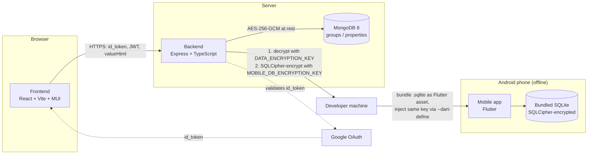

# NamelessNote — Architecture & Configuration Reference

This document describes how the three apps (frontend, backend, mobile) and
MongoDB fit together, the two independent encryption layers in the system,
and a full configuration reference. For narrower, app-specific docs see:

- [../README.md](../README.md) — quick start
- [../backend/README.md](../backend/README.md)
- [../frontend/README.md](../frontend/README.md)
- [../mobile/README.md](../mobile/README.md)
- [google-login-workaround.md](./google-login-workaround.md)

## System overview



There is **no runtime connection between the mobile app and the backend or
MongoDB.** The mobile app is a point-in-time, read-only snapshot: a
developer/operator runs an export command against the live database, and
the resulting file is compiled into the APK. The phone never talks to the
server, Google, or the internet to show its data.

## Components

### Frontend (`frontend/`)

React 18 + Vite + MUI single-page app. Handles Google Sign-In, sends the
Google `id_token` to the backend, stores the resulting app JWT, and renders
groups/properties. It never encrypts or decrypts anything itself — it
sends/receives `valueHtml` in clear text over HTTPS and trusts the backend
to handle encryption at rest. See [frontend/README.md](../frontend/README.md).

### Backend (`backend/`)

Express + TypeScript API. Responsibilities:

- Validates Google `id_token`s and issues its own JWTs.
- Scopes all groups/properties to `ownerId` + `ownerEmail` + `authProvider`.
- Encrypts property values with AES-256-GCM before writing to MongoDB, and
  decrypts them before returning them to the authorized owner over the API.
- Runs one-off scripts (not HTTP endpoints) to export the database:
  - `db_dump_data` → decrypted `.xlsx` (human backups/restores).
  - `db_dump_sqlite` → decrypted-then-SQLCipher-re-encrypted `.sqlite`
    (feeds the mobile app).
  - `db_restore` → re-encrypts values from an `.xlsx` back into MongoDB.

See [backend/README.md](../backend/README.md).

### MongoDB

Single `namelessnote` database, two collections: `groups`, `properties`.
Property values are never stored in plaintext — see
[Encryption layers](#encryption-layers) below.

### Mobile (`mobile/`)

Flutter Android app. Fully offline, no backend/network access, no
`DATA_ENCRYPTION_KEY`. It:

1. Requires the device's fingerprint/face/PIN via `local_auth` on every
   launch and every resume from background before showing anything
   (`lib/screens/lock_screen.dart`).
2. Copies the bundled, SQLCipher-encrypted `.sqlite` asset into the app's
   private storage on first run and opens it with `sqflite_sqlcipher`
   (backed by `net.zetetic:sqlcipher-android`), passing the passphrase that
   was compiled in via `--dart-define=VAULT_PASSPHRASE=...`.
3. Lists groups, expandable to their properties; a search bar toggles
   between searching `groups.groupName` and `properties.propertyNameLower`,
   with property search results shown as a flat "group + property" list.
4. Each property mirrors the web frontend's `PropertyRow.jsx`: value
   masked by default, with show/hide and copy-to-clipboard buttons.

See [mobile/README.md](../mobile/README.md) for the full build/customization
guide.

## Data model

### Group

```json
{
  "groupName": "Personal",
  "ownerId": "google-sub",
  "ownerEmail": "user@example.com",
  "authProvider": "google"
}
```

### Property

```json
{
  "groupId": "ObjectId(...)",
  "ownerId": "google-sub",
  "ownerEmail": "user@example.com",
  "authProvider": "google",
  "propertyNameOriginal": "Api Key",
  "propertyNameLower": "api key",
  "propertyValueEncrypted": "base64-ciphertext",
  "iv": "base64-iv",
  "authTag": "base64-auth-tag"
}
```

The mobile export's SQLite schema is the same shape, minus the encryption
fields (the value is already decrypted at that point) and with a `valueHtml`
column instead of the three ciphertext fields — see
[backend/src/scripts/db_dump_sqlite.ts](../backend/src/scripts/db_dump_sqlite.ts).

## Encryption layers

There are **two separate, unrelated encryption layers** in this system.
Mixing them up is the most likely source of confusion, so this section
spells out exactly what each one protects and which key it uses.

| | At rest in MongoDB | Mobile bundled export |
|---|---|---|
| Algorithm | AES-256-GCM | SQLCipher (AES-256-CBC + HMAC, compat mode 4) |
| Scope | One value per property field | The entire `.sqlite` file |
| Key | `DATA_ENCRYPTION_KEY` (backend `.env`) | `MOBILE_DB_ENCRYPTION_KEY` (backend `.env`) / `VAULT_PASSPHRASE` (mobile `--dart-define`) — **must be the same value** |
| Key ever reaches the device? | No — backend-only | Yes — it's compiled into the APK, because the app must decrypt fully offline |
| What it defends against | Anyone with raw MongoDB access (backup theft, DB compromise) reading property values | Someone extracting `assets/db/namelessnote.sqlite` from the APK (it's just a zip) and opening it in a generic SQLite viewer |
| What it does *not* defend against | A compromised backend process (it has the key in memory to serve requests) | Anyone who unzips the APK: the key sits as a plain string in `lib/<abi>/libapp.so` (verified). See [security-review.md](./security-review.md) |

Practically:

1. Google auth (`GOOGLE_CLIENT_ID`) has **nothing to do with either
   encryption layer**. It authenticates the user to the API; decryption
   only ever needs `iv` + `authTag` + `DATA_ENCRYPTION_KEY`
   (see [backend/src/utils/crypto.ts](../backend/src/utils/crypto.ts)).
2. `db_dump_sqlite.ts` is the bridge between the two layers: it reads
   AES-256-GCM-encrypted values from MongoDB, decrypts them with
   `DATA_ENCRYPTION_KEY`, writes them into a new SQLite file, then
   re-encrypts that whole file with SQLCipher using
   `MOBILE_DB_ENCRYPTION_KEY`.
3. `MOBILE_DB_ENCRYPTION_KEY` and `VAULT_PASSPHRASE` must be the same
   value. `npm run mobile:apk` (root `package.json`) keeps them in sync
   automatically by reading the former from `backend/.env` and passing it
   to `flutter build` as the latter — see
   [scripts/build-mobile-apk.js](../scripts/build-mobile-apk.js).

## Configuration reference

### Backend (`backend/.env`, from [backend/.env.example](../backend/.env.example))

| Variable | Purpose |
|---|---|
| `PORT` | HTTP port (default `4000`). |
| `NODE_ENV` | `development` / `production`. |
| `CORS_ORIGIN` | Comma-separated allowed origins for the frontend. |
| `MONGO_URI` | Mongo connection string. Inside Docker Compose: `mongodb://nameless_note_db:27017/namelessnote`. |
| `MONGO_URI_DUMP` | Optional override of `MONGO_URI`, used only by `db_dump_sqlite`/`db_dump_data` — needed when running those from the host (outside Docker), where the compose service hostname doesn't resolve. Example: `mongodb://localhost:27018/namelessnote`. |
| `GOOGLE_CLIENT_ID` | Google OAuth client ID; must match the frontend's. |
| `JWT_SECRET` / `JWT_EXPIRES_IN` | Signing secret and lifetime for the app's own JWT. |
| `DATA_ENCRYPTION_KEY` / `DATA_ENCRYPTION_ALGORITHM` | AES-256-GCM key (32 bytes, base64 or hex) for property values at rest. |
| `MOBILE_DB_ENCRYPTION_KEY` | SQLCipher passphrase for the mobile export — must match `VAULT_PASSPHRASE` used to build the mobile app. |
| `DEBUG` | Verbose logging toggle. |
| `HTTPS_ENABLED` / `HTTPS_CERT_FILE` / `HTTPS_KEY_FILE` | Local HTTPS for dev. |

### Frontend (`frontend/.env`, from [frontend/.env.example](../frontend/.env.example))

| Variable | Purpose |
|---|---|
| `VITE_APP_LANGUAGE` | UI language (`es`/`en`). |
| `VITE_API_BASE_URL` | Backend base URL, no trailing `/api`. |
| `VITE_GOOGLE_CLIENT_ID` | Must match the backend's `GOOGLE_CLIENT_ID`. |
| `DEV_HTTPS` / `DEV_HTTPS_CERT_FILE` / `DEV_HTTPS_KEY_FILE` | Local HTTPS for the Vite dev server. |

### Mobile (build-time, no `.env`)

The mobile app has no runtime configuration file — everything is baked in
at build time:

| Input | Where | Purpose |
|---|---|---|
| `VAULT_PASSPHRASE` | `flutter build apk --dart-define=VAULT_PASSPHRASE=...` | SQLCipher key to open the bundled export. Read in [mobile/lib/data/vault_passphrase.dart](../mobile/lib/data/vault_passphrase.dart); falls back to a placeholder (won't open a real export) if omitted. |
| `mobile/assets/db/namelessnote.sqlite` | File on disk, generated by `db_dump_sqlite` | The bundled data. Gitignored — regenerate locally, never commit a populated copy. |
| `mobile/assets/icon/icon.png` | File on disk | Launcher icon source (1024x1024 PNG); regenerate variants with `dart run flutter_launcher_icons`. |
| App name / package ID / version | `AndroidManifest.xml`, `build.gradle.kts`, `pubspec.yaml` | See the customization table in [mobile/README.md](../mobile/README.md#customizing-name-icon-and-metadata). |

## Common workflows

### Start the full dev stack (frontend + backend + Mongo, Docker)

```powershell
npm run dev
```

### Run backend/frontend locally without Docker

```powershell
cd backend && copy .env.example .env && npm install && npm run dev
cd frontend && copy .env.example .env && npm install && npm run dev
```

### Export/restore the database (Excel, human-editable backups)

```powershell
cd backend
npm run db_dump_data              # -> exports/namelessnote-dump-<timestamp>.xlsx
npm run db_restore -- ./exports/my-backup.xlsx
```

### Build the mobile app

```powershell
npm run mobile:apk            # dump (SQLCipher-encrypted) + flutter build apk --release
npm run mobile:apk:skip-dump  # reuse the existing .sqlite, just rebuild the app
npm run mobile:dump           # only refresh mobile/assets/db/namelessnote.sqlite
```

Output: `mobile/build/app/outputs/flutter-apk/app-release.apk`. See
[mobile/README.md](../mobile/README.md) for install instructions (USB/adb or
manual APK transfer) and the full threat-model discussion.

## Repository structure

```
backend/    Express API, auth, encryption, Mongo access, dump/restore/export scripts
frontend/   React SPA with Google Sign-In
mobile/     Flutter Android app (offline, biometric-locked viewer)
scripts/    Cross-app helper scripts (e.g. build-mobile-apk.js)
docs/       Architecture and operational notes (this file, Google login notes)
certs/      Local development certificates
docker-compose.yml       Main stack
docker-compose.dev.yml   Development override
```

## Operational notes

- Do not use `docker compose down -v` unless you intentionally want to
  delete MongoDB data.
- From the host, Mongo is reachable at `mongodb://localhost:27018/namelessnote`;
  from inside the Docker network, `mongodb://nameless_note_db:27017/namelessnote`
  (see `MONGO_URI_DUMP` above for the dump/export scripts specifically).
- Exported `.xlsx` and `.sqlite` files both contain decrypted property
  values — treat them as sensitive, don't commit or upload them. Both
  `backend/exports/*` and `mobile/assets/db/namelessnote.sqlite` are
  gitignored for this reason.
